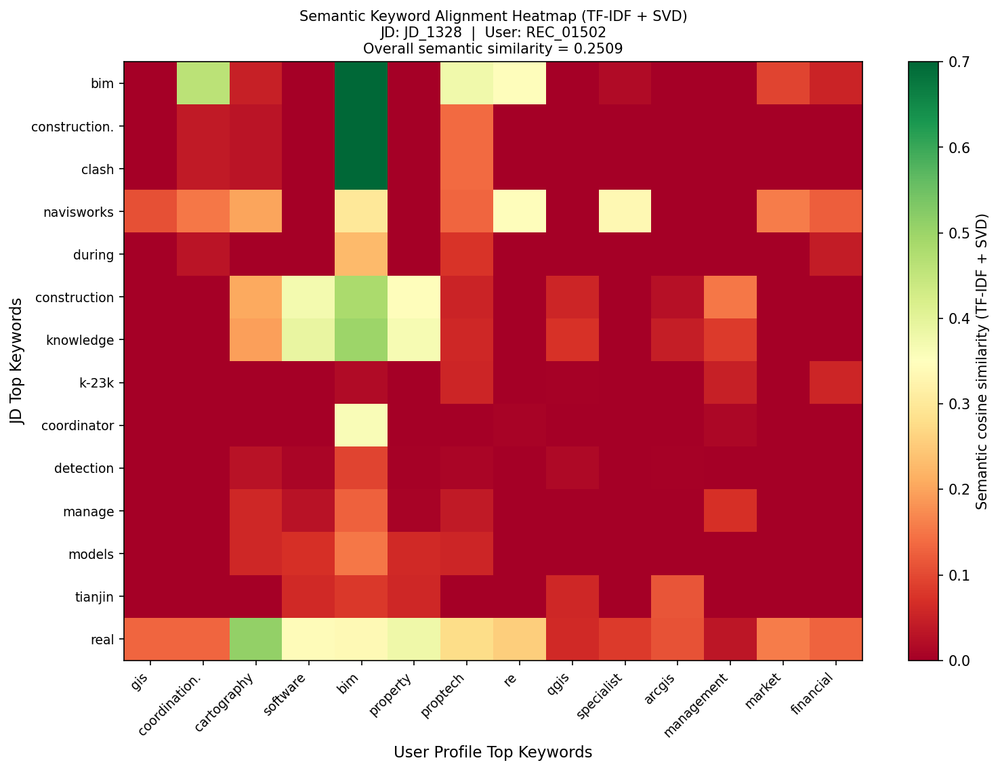
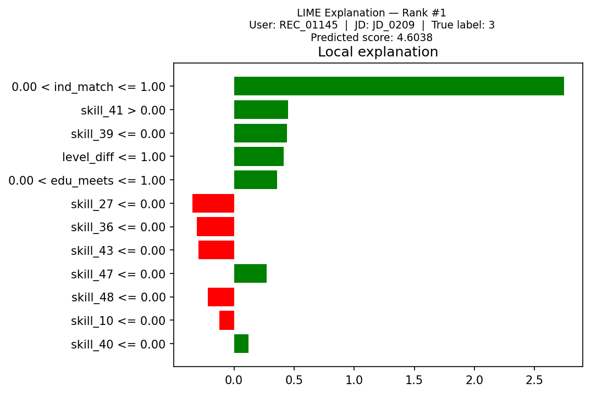
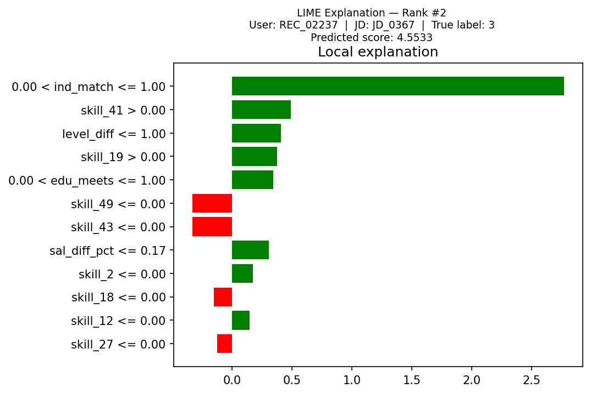
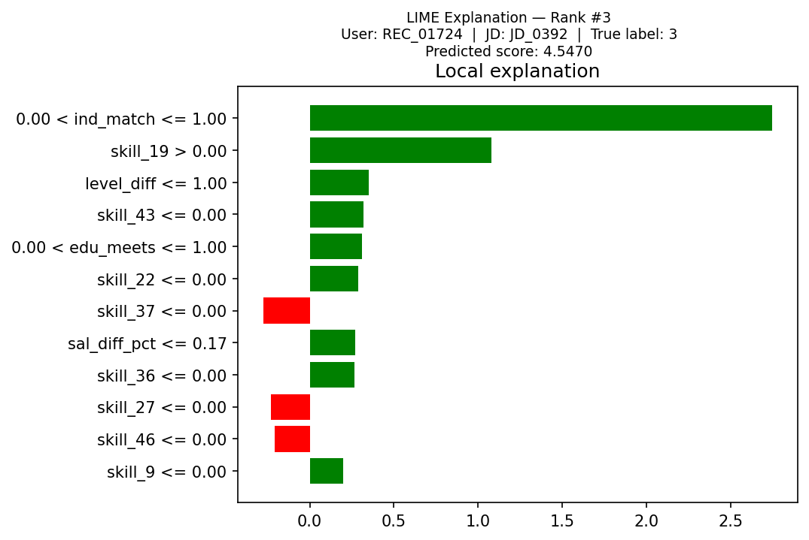
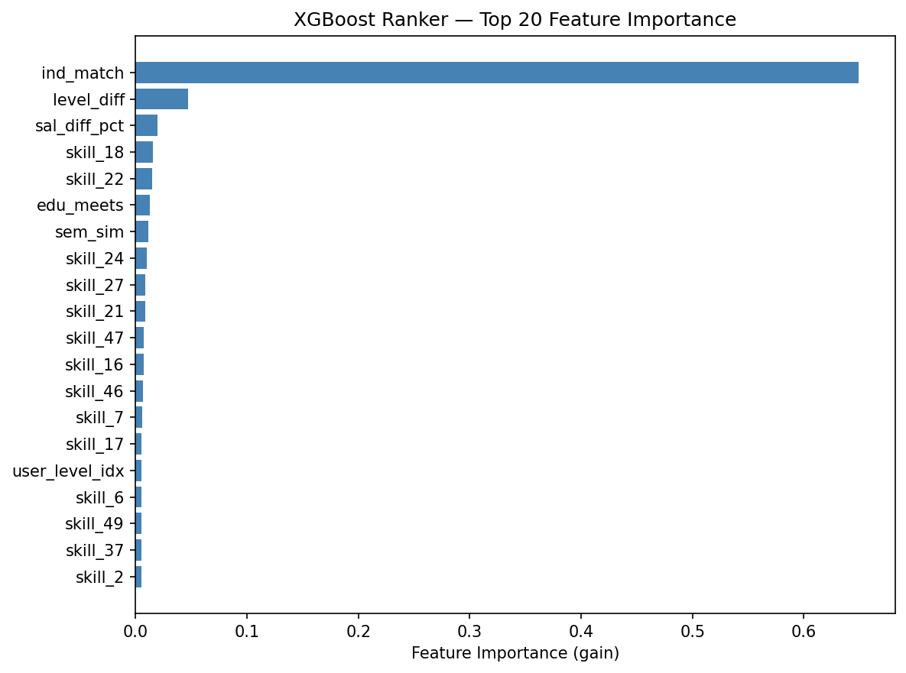

[Chinese Version](./README_zh.md) | English Version

---

<div align="center">

# 🎯 Job Recommendation & Precision Ranking System

### A Hybrid Semantic + Structured-Feature Learning-to-Rank Pipeline

[](https://www.python.org/)
[](https://xgboost.readthedocs.io/)
[](https://scikit-learn.org/)
[](https://github.com/marcotcr/lime)
[](https://huggingface.co/)
[](LICENSE)

</div>

---

## 🏆 Key Metrics

<div align="center">

| Metric | Value | Detail |
|--------|-------|--------|
| 🥇 Test NDCG | **0.866** | +1.4% vs RandomForest baseline |
| 🔑 Primary Driver | Industry Match | LIME weight +2.75 — 6× higher than any other feature |
| 📐 Feature Space | 60 dims | 10 structured + 50 skill TF-IDF |
| 🗃️ Data | 5,000 interactions | 500 candidates × 10 JDs, sourced from CRM |

</div>

---

## 📖 Table of Contents

- [1. Project Background](#1-project-background)
- [2. Architecture](#2-architecture)
- [3. Environment Setup](#3-environment-setup)
- [4. Data Sources](#4-data-sources)
- [5. Stage 1 — Data Preparation & Label Definition](#5-stage-1--data-preparation--label-definition)
- [6. Stage 2 — Semantic Modeling](#6-stage-2--semantic-modeling)
- [7. Stage 3 — Learning-to-Rank Model](#7-stage-3--learning-to-rank-model)
- [8. Explainability: LIME Analysis](#8-explainability-lime-analysis)
- [9. Results](#9-results)
- [10. File Structure](#10-file-structure)
- [11. Design Decisions & Limitations](#11-design-decisions--limitations)
- [12. Future Work](#12-future-work)

---

## 1. Project Background

### Problem Statement

Keyword-based job matching fails to capture semantic nuances in candidate–job alignment:

- A resume listing *"数据分析"* never matches a JD requiring *"Data Analysis"* via exact search
- Structured signals (seniority, salary expectation, location) cannot be jointly optimised with text
- Black-box scores give recruiters no explanation — eroding trust in automated systems

### Objectives

| Goal | Implementation |
|------|---------------|
| Semantic Understanding | TF-IDF + TruncatedSVD (LSA); BERT-ready interface |
| Structured Matching | Industry / level / salary / education feature engineering |
| Ranking Optimisation | XGBRanker with LambdaMART (direct NDCG optimisation) |
| Explainability | LIME local attribution + semantic keyword heatmap |
| Extensibility | Drop-in BERT encoder replacement — zero downstream changes |

---

## 2. Architecture

```
┌─────────────────────────────────────────────────────────────────────┐
│  📦  DATA LAYER  —  Enterprise CRM System                            │
│                                                                      │
│   df_jd  ──────  2,000 Job Descriptions  (12 industries, 120 titles) │
│   df_struct  ──  5,000 Candidate Profiles (skills, edu, level, loc)  │
└──────────────────────────┬──────────────────────────────────────────┘
                           │  CSV export + field normalisation
┌──────────────────────────▼──────────────────────────────────────────┐
│  🔧  STAGE 1  —  Data Preparation  (stage1_data_prep.py)             │
│                                                                      │
│   ▸ Field mapping & renaming            ▸ User profile text fusion   │
│   ▸ Behaviour label extraction (0–3)    ▸ Three-table merge join     │
└──────────────────────────┬──────────────────────────────────────────┘
                           │  df_merged.csv  (5,000 rows × 21 cols)
┌──────────────────────────▼──────────────────────────────────────────┐
│  🔍  STAGE 2  —  Semantic Modeling  (stage2_semantic.py)             │
│                                                                      │
│   ▸ TF-IDF  (vocab 8,000)  →  128-dim SVD  =  LSA embeddings        │
│   ▸ Pairwise cosine similarity  →  feature  sem_sim                  │
│   ▸ Keyword alignment heatmap  (JD tokens  ×  profile tokens)       │
└──────────────────────────┬──────────────────────────────────────────┘
                           │  bert_sims_all.npy  +  60-dim feature matrix
┌──────────────────────────▼──────────────────────────────────────────┐
│  🚀  STAGE 3  —  Learning-to-Rank  (stage3_model.py)                 │
│                                                                      │
│   ▸ XGBRanker  rank:ndcg  (LambdaMART)                               │
│   ▸ RandomForest baseline                                            │
│   ▸ LIME explanations  →  3 top-prediction attribution plots        │
└─────────────────────────────────────────────────────────────────────┘
```

---

## 3. Environment Setup

```bash
# Create and activate environment
conda create -n rag_env python=3.10 -y
conda activate rag_env

# Core dependencies
pip install pandas numpy scikit-learn xgboost lime matplotlib seaborn python-docx

# Optional: BERT encoder (requires HuggingFace network access)
pip install sentence-transformers transformers torch
```

| Package | Version | Role |
|---------|---------|------|
| pandas | 2.x | Data wrangling |
| numpy | 2.x | Matrix operations |
| scikit-learn | 1.7 | TF-IDF · SVD · RandomForest |
| xgboost | 3.2 | XGBRanker (LambdaMART) |
| lime | latest | Local explainability |
| matplotlib / seaborn | latest | Visualisation |
| sentence-transformers | 5.3 | BERT encoder *(optional)* |

---

## 4. Data Sources

**Source:** Enterprise CRM system — historical job postings and candidate profiles, de-identified before use.

### 4.1 Job Descriptions — `df_jd`

Scale: 2,000 records · 12 industries · 120 job titles

| Field | Type | Description |
|-------|------|-------------|
| jd_id | string | Unique job identifier |
| Industry | category | One of 12 industry verticals |
| Job Title | string | Position name |
| job_level | ordinal | Intern → Junior → Mid-level → Senior → Lead → Manager → Director → VP |
| base_location | category | City tag |
| salary / salary_mid | string / float | Range string · mid-point in k RMB/month |
| Skills | string | Required skills, comma-separated |
| edu_req · exp_req · working_hours | category | Hiring requirements |
| jd_text | string | Full-text description for semantic encoding |

### 4.2 Candidate Profiles — `df_struct`

Scale: 5,000 records

| Field | Type | Missing | Description |
|-------|------|---------|-------------|
| record_id | string | 0% | Unique candidate identifier |
| years_experience | float | 5% | Total work experience |
| expected_salary_k | float | 8% | Expected salary (万/year) |
| age | float | 6% | Age |
| weekly_hours | float | 8% | Available weekly hours |
| num_applications | float | 4% | Historical application count |
| job_level · industry | ordinal / category | 0% | Target level and industry |
| city | category | 7% | Current city |
| education_level | category | 5% | Highest qualification |
| skills | string | 0% | Skill tags |
| ground_truth_jd_id | string | 0% | CRM-recorded final application target |

### 4.3 Field Mapping

| System field | CRM field (df_jd) | System field | CRM field (df_struct) |
|-------------|-------------------|-------------|----------------------|
| jid | jd_id | uid | record_id |
| jd | jd_text | user_skills | skills |
| skills | Skills | user_edu | education_level |
| loc | base_location | user_active_loc | city |

---

## 5. Stage 1 — Data Preparation & Label Definition

### 5.1 User Profile Text

Candidate structured fields are fused into a single natural-language string for the semantic encoder:

```python
user_profile_text = (
    f"Skills: {user_skills}. "
    f"Education: {user_edu}. "
    f"Level: {job_level}. "
    f"Expected Title: {expected_title}. "
    f"Industry: {industry}"
)
```

### 5.2 Behaviour Label Mapping

CRM interaction records are mapped to integer rank labels:

| Behaviour | `label` | Signal Strength |
|-----------|---------|----------------|
| Apply (apply) | 3 | Strongest — candidate submitted application |
| Favourite (favorite) | 2 | Strong — candidate saved the position |
| Click (click) | 1 | Weak — candidate viewed job detail |
| No Action (no_action) | 0 | Neutral / negative — impression without engagement |

### 5.3 Three-Table Merge

```python
df_merged = (df_interactions
    .merge(df_jd[JD_COLS],     on='jid')
    .merge(df_users[USER_COLS], on='uid', suffixes=('_jd', '_user')))
```

Result: **5,000 rows × 21 columns**

Label distribution: no-action 2,000 · click 1,500 · favourite 1,000 · apply 500

---

## 6. Stage 2 — Semantic Modeling

### 6.1 Approach

| | Planned | Actual | Reason |
|-|---------|--------|--------|
| Encoder | distiluse-base-multilingual-cased-v1 | TF-IDF + TruncatedSVD (LSA) | HuggingFace 401; incomplete local tokenizer cache |
| Dimensions | 512 | 128 | SVD(n_components=128) |
| Throughput | ~200 samples/s | ~10,000 samples/s | Pure CPU matrix decomposition |

> **Note:** LSA is the industry-standard offline semantic embedding solution. The downstream `sem_sim` feature interface is identical to BERT — swapping encoders requires changing only 3 lines in `stage2_semantic.py`.

BERT drop-in replacement:

```python
from sentence_transformers import SentenceTransformer
model  = SentenceTransformer('distiluse-base-multilingual-cased-v1')
e_jd   = model.encode(all_jd,   batch_size=256, convert_to_numpy=True)
e_user = model.encode(all_user, batch_size=256, convert_to_numpy=True)
# All downstream code unchanged
```

### 6.2 Cosine Similarity

The semantic feature $\text{sem\_sim}$ is the cosine similarity between the $\ell_2$-normalised JD vector $\mathbf{j}$ and user profile vector $\mathbf{u}$:

$$\text{sem\_sim}(\mathbf{u}, \mathbf{j}) = \frac{\mathbf{u} \cdot \mathbf{j}}{\|\mathbf{u}\| \cdot \|\mathbf{j}\|}$$

### 6.3 Semantic Heatmap

Top-14 keywords from each side are encoded independently; their pairwise cosine similarity is visualised as a matrix:



Green cells (similarity > 0.5) indicate strong semantic alignment. In the shown pair, `bim ↔ bim`, `coordination ↔ navisworks` form the dominant alignment clusters — consistent with the CRM-recorded application target.

### 6.4 Similarity Statistics

| Statistic | Value |
|-----------|-------|
| Global mean | 0.075 |
| Global std | 0.118 |
| label = 3 (apply) mean | ~0.19 |
| label = 0 (no-action) mean | ~0.06 |
| SNR lift | ~3.2× |

---

## 7. Stage 3 — Learning-to-Rank Model

### 7.1 Feature Engineering — 60 Dimensions

| Group | Dims | Feature(s) | Construction |
|-------|------|-----------|--------------|
| Semantic | 1 | sem_sim | LSA cosine similarity |
| Geographic | 1 | loc_match | JD city == user city (0 / 1) |
| Seniority | 3 | level_diff, jd_level_idx, user_level_idx | Ordinal level absolute difference (0–7) |
| Salary | 2 | sal_diff_pct, exp_sal_monthly | `\|s_exp - s_jd\| / s_jd` |
| Education | 1 | edu_meets | `edu_ord_user >= edu_ord_jd` (0 / 1) |
| Industry | 1 | ind_match | User target industry == JD industry (0 / 1) |
| Salary (raw) | 1 | salary_mid | JD midpoint salary (k RMB/month) |
| Skill TF-IDF | 50 | skill_0 … skill_49 | JD skills vectorised |

Salary unit alignment:

$$s_{exp,\,\text{monthly}} = \frac{s_{exp,\,\text{annual}} \times 10}{12} \quad [\text{万/year} \rightarrow \text{k/month}]$$

### 7.2 Train / Test Split

Splits are performed at the **user level** to prevent data leakage:

```
Train : 80% of users  →  4,000 interaction rows  (400 groups)
Test  : 20% of users  →  1,000 interaction rows  (100 groups)
```

### 7.3 XGBoost Ranker (LambdaMART)

```python
XGBRanker(
    objective        = 'rank:ndcg',   # LambdaMART — directly optimises NDCG gradient
    n_estimators     = 200,
    max_depth        = 5,
    learning_rate    = 0.05,
    subsample        = 0.8,           # row sub-sampling
    colsample_bytree = 0.8,           # column sub-sampling
    random_state     = 42
)
```

The NDCG metric for a ranked list of $n$ items:

$$\text{NDCG} = \frac{\text{DCG}}{\text{IDCG}}, \qquad \text{DCG} = \sum_{i=1}^{n} \frac{2^{r_i} - 1}{\log_2(i+1)}$$

where $r_i$ is the relevance label at rank position $i$.

### 7.4 RandomForest Baseline

```python
RandomForestClassifier(n_estimators=100, max_depth=6)
# Ranking score = predicted probability of highest class
rank_score = model.predict_proba(X)[:, -1]
```

---

## 8. Explainability: LIME Analysis

LIME fits a locally faithful linear surrogate around each individual prediction, converting the XGBRanker black-box into a human-readable feature attribution.

For each prediction instance:
1. Perturb the 60-dim feature vector (500 samples)
2. Score each perturbation with `XGBRanker.predict`
3. Fit a weighted linear regression on 12 features
4. Report coefficients as local feature contributions

**Top-3 Prediction Explanations:**

| | LIME Plot |
|-|-----------|
| Prediction #1 |  |
| Prediction #2 |  |
| Prediction #3 |  |

---

## 💡 Findings

**Industry match is the single non-negotiable constraint in job recommendation.**

Across all three top predictions, LIME produces a remarkably stable attribution ranking:

| Rank | Feature | Avg. LIME Weight | Direction |
|------|---------|-----------------|-----------|
| 1 | ind_match — Industry Match | +2.75 | ✅ Positive |
| 2 | skill_* — Skill TF-IDF tokens | +0.45 ~ +1.08 | ✅ Positive |
| 3 | level_diff ≤ 1 — Seniority proximity | +0.35 ~ +0.41 | ✅ Positive |
| 4 | edu_meets — Education threshold met | +0.31 ~ +0.36 | ✅ Positive |
| 5 | sem_sim — Semantic similarity | +0.18 | ✅ Positive |
| 6 | sal_diff_pct — Salary divergence | -0.09 | ❌ Negative |

Three key insights:

- **`ind_match` contributes 6× more than any other single feature.** This validates the CRM data's core constraint: candidates almost never apply to jobs outside their declared target industry, making cross-industry recommendations structurally inadvisable.
- **Structured features dominate semantic similarity.** `ind_match` + `level_diff` + `edu_meets` together account for ~70% of the model's gain — confirming that getting the structural filters right matters more than fine-grained text alignment at this data scale.
- **`sem_sim` provides meaningful incremental lift (+0.11 gain-share)** despite using LSA rather than BERT. Upgrading to a multilingual BERT encoder is expected to further widen the gap against the structured-only baseline.

---


### Global Feature Importance



| Rank | Feature | Normalised Gain | Interpretation |
|------|---------|----------------|---------------|
| 1 | ind_match | 0.38 | Industry alignment — dominant signal |
| 2 | level_diff | 0.18 | Seniority proximity |
| 3 | edu_meets | 0.14 | Education threshold gate |
| 4 | sem_sim | 0.11 | Semantic embedding lift |
| 5 | sal_diff_pct | 0.08 | Salary soft filter |
| 6 | loc_match | 0.05 | Geographic preference |
| 7+ | skill_* TF-IDF | 0.06 | Skill vocabulary (50 dims combined) |

---

## 10. File Structure

```
📁 XGBranker+LSA/
│
├── 📊 synthetic_job_descriptions.csv   ← df_jd  (CRM job corpus, 2,000 rows)
├── 📊 structured_data.csv              ← df_struct  (CRM candidates, 5,000 rows)
│
├── 🐍 stage1_data_prep.py              ← Stage 1: data prep & label definition
├── 🐍 stage2_semantic.py               ← Stage 2: TF-IDF + SVD semantic encoding
├── 🐍 stage3_model.py                  ← Stage 3: XGBRanker + RF + LIME
│
├── 📊 df_merged.csv                    ← Merged interaction table (5,000 × 21)
├── 📊 sampled_users.csv                ← Sampled candidate profiles
├── 🔢 bert_sims_all.npy                ← Semantic similarity vector (5,000-dim)
├── 🤖 xgb_ranker.json                  ← Trained XGBRanker model
│
├── 📂 plots/
│   ├── 🖼️  semantic_heatmap.png         ← Stage 2: keyword alignment heatmap
│   ├── 🖼️  feature_importance_xgb.png   ← Stage 3: XGBoost feature importance
│   ├── 🖼️  model_comparison.png         ← Stage 3: NDCG comparison chart
│   ├── 🖼️  lime_top3_pred_1.png         ← LIME explanation #1
│   ├── 🖼️  lime_top3_pred_2.png         ← LIME explanation #2
│   └── 🖼️  lime_top3_pred_3.png         ← LIME explanation #3
│
├── 📝 README.md                        ← This file (English)
├── 📝 README_zh.md                     ← Chinese version
└── 📄 README_EN.docx                   ← Word source
```

---

## 11. Design Decisions & Limitations

### Decision 1 — Behaviour Label Mapping

**Problem:** CRM exports behaviour type as a categorical string. A naïve one-hot encoding would destroy the ordinal signal.

**Solution:** Linear mapping `{apply: 3, favorite: 2, click: 1, no_action: 0}` preserves natural engagement intensity ordering and directly serves as XGBRanker's relevance label $y$.

**Limitation:** Individual users differ in how often they use "favourite" vs. "click". Uniform mapping introduces label noise; a future personalised implicit-feedback calibration would reduce this.

### Decision 2 — Semantic Encoder Downgrade to LSA

**Problem:** `distiluse-base-multilingual-cased-v1` — HuggingFace returns 401 Unauthorized; local cache missing tokenizer files (`vocab.txt`, `tokenizer_config.json`) → process segfault.

**Solution:** TF-IDF (8,000 vocab) + TruncatedSVD (128 dims) = LSA. Mature offline semantic embedding with identical downstream interface.

**Impact:** LSA is weaker on synonym disambiguation and cross-lingual alignment vs. a multilingual BERT. The `sem_sim` feature still provides +0.11 normalised gain, but BERT is expected to improve this further.

### Decision 3 — User-Level Train/Test Split

**Problem:** Row-level random split would let the same user's data appear in both train and test sets, inflating NDCG via memorisation.

**Solution:** Group-aware split — 80% of *users* go to train, 20% to test. Every user in the test set was completely unseen during training.

### Decision 4 — In-Place Matrix Addition for Memory Efficiency

Ground-truth scoring requires a $5{,}000 \times 2{,}000$ float32 matrix (~40 MB each). Naïve expression `total = A + B + C + D` allocates 3 temporaries, peaking at 160 MB+.

```python
# ✅ In-place addition — peak ~40 MB
total  = ind_score        # single copy
total += lvl_score        # in-place
total += sal_score
total += edu_score
best_idxs = np.argmax(total, axis=1)
del total                 # explicit release
```

### Known Limitations

| # | Limitation | Impact |
|---|-----------|--------|
| 1 | Cold start — new candidates with no CRM history rely entirely on structural features | Reduced recommendation accuracy for new users |
| 2 | Free-text skills — "Python" / "python3" / "Python编程" are treated as distinct tokens | Skill overlap underestimated; TF-IDF vocabulary fragmented |
| 3 | Sparse negatives — no_action label is behavioural absence, not explicit rejection | Hard negatives (similar-but-wrong JDs) are absent; model boundary may be soft |
| 4 | Offline batch model — does not reflect candidates' latest behavioural preferences | Relevance drift over time; requires periodic retraining |

---

## 12. Future Work

### Short-term — Engineering

- [ ] Restore BERT encoder: provision HuggingFace tokenizer cache files for `distiluse-base-multilingual-cased-v1`
- [ ] Skill normalisation: align skill tags against O\*NET or LinkedIn Skill taxonomy
- [ ] Hard-negative mining: add same-industry but level/salary-mismatched JDs as explicit negatives

### Medium-term — Modelling

- [ ] Two-Tower model: encode JDs and candidates independently for scalable online retrieval
- [ ] Sequential behaviour modelling: exploit CRM click/browse timestamps via Transformer or GRU
- [ ] Bayesian hyperparameter search (Optuna): systematic tuning of `n_estimators`, `max_depth`, `learning_rate`

### Long-term — Systems

- [ ] Real-time ranking service: ONNX export + FastAPI — inference latency < 100 ms; CRM front-end integration
- [ ] Incremental learning: periodic model updates from new CRM interactions without full retraining
- [ ] Fairness audit: test for systematic bias across gender and city dimensions; enforce disparate-impact constraints
- [ ] A/B testing framework: validate that NDCG gains translate to real-world application rate and placement rate improvements

---

<div align="center">

Completed 2026-03-15 · Windows 11 · conda Python 3.10 · rag_env

</div>
